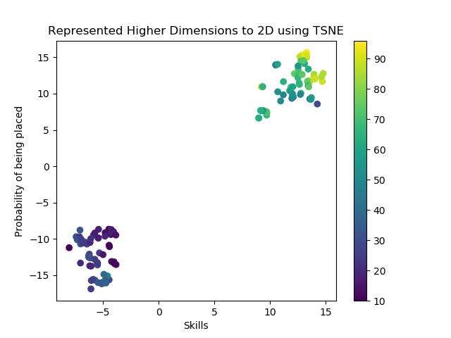

### Introduction
This project aims at building a Placement Prediction system using Artificial Neural Networks.  
This is my Final Year Project of my Bachelor's in Computer Engineering.

### Dataset
The Dataset consists of the qualitative and the quantitative parameters of the students that are necessary for improving the prediction.  
  
<table>
	<tbody>
		<tr>
			<td><b>Qualitative Parameters</b></td>
          <td><b>Quantitative Parameters</b></td>
		</tr>
		<tr>
      <td>Aptitude Skills</td>
			<td>Coding Skills</td>
		</tr>
		<tr>
			<td>Communication Skills</td>
			<td>Technical Skills</td>
		</tr>
		<tr>
			<td>Core Knowledge</td>
			<td>Academic Performance</td>
		</tr>
		<tr>
			<td>Presentation Skills</td>
			<td>Programming Skills</td>
		</tr>
    <tr>
      <td>Puzzle Solving Skills</td>
			<td>Projects</td>
		</tr>
		<tr>
			<td>English Proficiency</td>
			<td>Internships</td>
		</tr>
		<tr>
			<td>Management Skills</td>
			<td>Training</td>
		</tr>
		<tr>
			<td></td>
			<td>Backlogs</td>
		</tr>
</table>

#### Currently the dataset is provided is sample data and not actual data

### Implementation
Python (2.7) is used as it has good compatability with Machine Learning by using scikit learn, numpy, matplotlib libraries.  
The 3D plot of qualitative parameters, quantitative parameters and the probability of being placed is mapped in the 3D space and then for prediction.  
There are multiple methods of plotting the data, two of which are given in this repository.  
1. Averaging the values of the parameters and represent it as a 3D plot. _Graph is as shown:_  
  
  
2. T-Distributed Stochastic Neighbor Embedding (TSNE) is used to visualize Higher Dimensional data into Lower Dimensions. In this method, the parameters are combined by using TSNE method (sklearn.manifold.TSNE) to obtain a 2D plot. _Graph is as shown:_  
  
  
K-Nearest Neighbour is then applied to the data.
