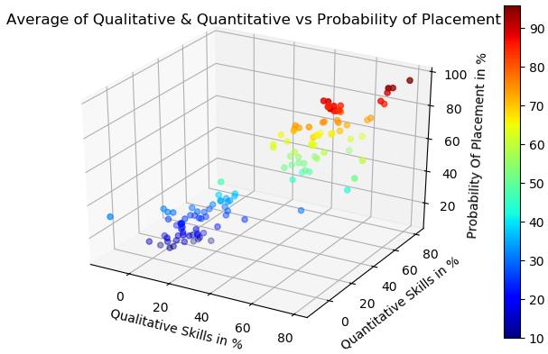

# Introduction
This project aims at building a Placement Prediction system using Artificial Neural Networks.  
This is my Final Year Project of my Bachelor's in Computer Engineering.

# Dataset
The Dataset consists of the qualitative and the quantitative parameters of the students that are necessary for improving the prediction.  

Qualitative Parameters:
>    1. Aptitude Skills
>    2. Communication Skills
>    3. Core Knowledge
>    4. Presentation Skills
>    5. Puzzle Solving skills
>    6. English Proficiency
>    7. Management Skills

Quantitative Parameters:
>    1. Coding Skills
>    2. Technical Skills
>    3. Academic Performance
>    4. Programming Skills
>    5. Projects
>    6. Internships
>    7. Training
>    8. Backlogs

## Currently the dataset is provided is sample data and not actual data

# Implementation
Python (2.7) is used as it has good compatability with Machine Learning by using numpy, matplotlib libraries.  
The 3D plot of qualitative parameters, quantitative parameters and the probability of being placed is mapped in the 3D space and then for prediction. Graph is as shown:  

T-Distributed Stochastic Neighbor Embedding (TSNE) is applied to visualize Higher Dimensional data into Lower Dimensions. 
K-Nearest Neighbour is then applied to the data.